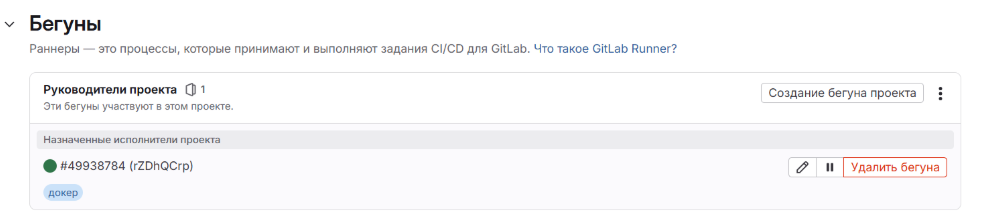
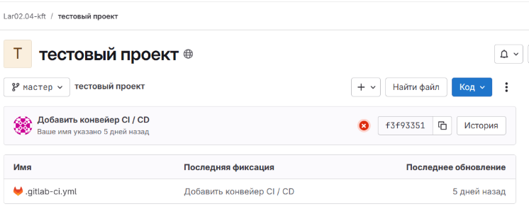

# GitLab 

### Задание 1
**Что нужно было сделать:**
Развернуть GitLab локально, создать проект, зарегистрировать GitLab Runner в режиме Docker.

#### Выполнение задания

**Этап 1: Попытки развертывания локального GitLab**
Было предпринято несколько попыток развертывания GitLab:

1. **Yandex Cloud VM** - постоянные зависания Docker
2. **Локальная установка** - зависания на этапе настройки
3. **Vagrant** - проблемы с репозиториями
4. **Docker Compose** - ошибки и зависания

Из-за технических проблем было принято решение использовать GitLab.com

**Этап 2: Работа с GitLab.com**
- Создан проект: https://gitlab.com/Lar02.04-kft/test-project
- Установлен и зарегистрирован GitLab Runner
- Настроен CI/CD пайплайн

**Доказательства выполнения:**
- GitLab Runner зарегистрирован
- Проект создан в GitLab
- Базовый CI/CD настроен




### Задание 2
**Что нужно было сделать:**
Запушьте репозиторий на GitLab, изменив origin. Создайте расширенный .gitlab-ci.yml.

#### Выполнение задания
- Репозиторий перенесен на GitLab: https://gitlab.com/Lar02.04-kft/gitlab-hw
- Настроен расширенный CI/CD пайплайн с этапами: test, static-analysis, build
- Все этапы успешно выполняются

**Расширенный .gitlab-ci.yml:**
```yaml
stages:
  - test
  - static-analysis
  - build

test:
  stage: test
  image: alpine:latest
  script:
    - echo "Running tests"
    - echo "All tests passed!"

code-quality:
  stage: static-analysis
  image: alpine:latest
  script:
    - echo "Running code quality checks"
    - echo "Code quality: OK"

build:
  stage: build
  image: docker:latest
  script:
    - echo "Building application"

